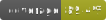

My first workflow

<!-- Click on the workflow, click on "..." and click "create status badge" and copy the url -->

Jacoco coverage badge

<!-- Go to the space name, coverage>paf2.giphy>jacoco.svg>copy url -->
<!--  -->
